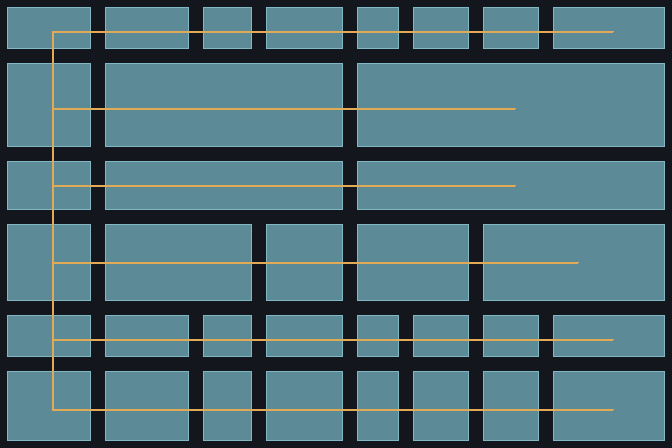

# sml-bsp

Binary Space Partitioning dungeon generator with rooms and corridors in pure Standard ML



*Generated by [`examples/dungeon.sml`](examples/dungeon.sml) (`make example`):
`Bsp.split` builds the partition, `Bsp.rooms` are filled over a wall
background, and `Bsp.corridors` are carved as the connecting lines. Rendered
with the vendored `sml-raster` / `sml-image`.*

## Installation

```
smlpkg add github.com/sjqtentacles/sml-bsp
smlpkg sync
```

## Usage

```sml
(* Define the root bounding box *)
val root = {x = 0, y = 0, w = 80, h = 50}

(* Build a BSP tree: seed, max depth, min room size, root rect *)
val tree = Bsp.split 42 5 4 root

(* Extract rooms and corridors *)
val rooms    : Bsp.rect list = Bsp.rooms tree
val corridors : Bsp.rect list = Bsp.corridors tree

(* Render to a 2D char array (w x h) *)
val grid = Bsp.toGrid tree 80 50
(* grid.(y).(x) = '.' for floor, '#' for wall *)

(* Rooms are non-overlapping and fit within the bounds *)
val _ = List.length rooms   (* >= 1 *)
```

## Testing

```
make test       # MLton
make test-poly  # Poly/ML
```

## License

MIT
